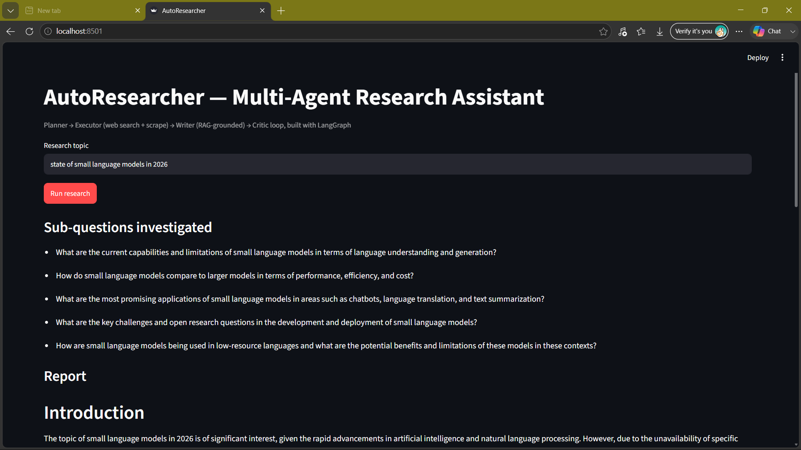

# AutoResearcher : Multi-Agent Autonomous Research System

An **agentic AI** system that takes a research topic and autonomously
plans, searches the web, grounds findings via RAG, drafts a cited report, and
self-critiques/revises built with **LangGraph**, **Groq (LLaMA-3.3-70b)**, and **FAISS**.

## Demo


## Architecture

```
        START
          |
          v
     [ Planner ]   -- decomposes topic into 3-5 sub-questions
          |
          v
     [ Executor ]  -- web search (DuckDuckGo) + scrapes each result
          |
          v
      [ Writer ]   -- builds FAISS index over evidence (RAG), retrieves
          |            top chunks per sub-question, drafts cited report
          v
      [ Critic ]   -- checks coverage / grounding / clarity
        /    \
   REVISE    PASS
      |         |
      ^-(loop)  v
              END (final_report)
```

This is a **planner-executor-critic multi-agent pattern**: each node is an
independent LangGraph agent with its own prompt and responsibility, sharing
state through a typed `ResearchState`. The Writer<->Critic edge is a
**conditional loop**, bounded by `MAX_REVISION_CYCLES`, so the system
self-corrects instead of returning a first-draft answer.

## Key engineering points (for interviews / resume)

- **Multi-agent orchestration** with LangGraph `StateGraph`, conditional edges, and
  a bounded self-revision loop (Critic -> Writer).
- **Tool-calling agent**: Executor performs live web search + HTML scraping
  (BeautifulSoup) per sub-question, with retry/backoff via `tenacity`.
- **RAG grounding**: evidence is chunked, embedded with `sentence-transformers`,
  indexed in FAISS, and retrieved per sub-question so the Writer cites sources
  instead of hallucinating ([n] inline citations + Sources section).
- **Typed shared state** (`TypedDict` + `operator.add` reducer) across agent nodes.
- **Two interfaces**: FastAPI REST endpoint (`/research`) for integration, and a
  Streamlit UI for demoing.
- **Defensive parsing**: planner output is JSON-validated with a regex/line-split
  fallback in case the LLM doesn't return clean JSON.

## Setup

```bash
uv venv && source .venv/bin/activate
uv pip install -e .
```

## Run

CLI:
```bash
python -m agents.graph "current state of multimodal RAG systems"
```

UI:
```bash
streamlit run streamlit_app.py
```

## Project structure

```
autoresearcher/
├── agents/
│   ├── state.py      # shared TypedDict state
│   ├── llm.py         # Groq LLM client
│   ├── planner.py     # topic -> sub-questions
│   ├── executor.py     # sub-questions -> scraped evidence
│   ├── writer.py        # evidence -> RAG-grounded draft report
│   ├── critic.py         # draft -> PASS or revision feedback
│   └── graph.py            # LangGraph wiring + run_research()
├── tools/
│   ├── search_tools.py   # DuckDuckGo search + scraping
│   └── rag_store.py        # FAISS evidence store
├── main.py               # FastAPI app
├── streamlit_app.py        # Streamlit UI
└── pyproject.toml
```


